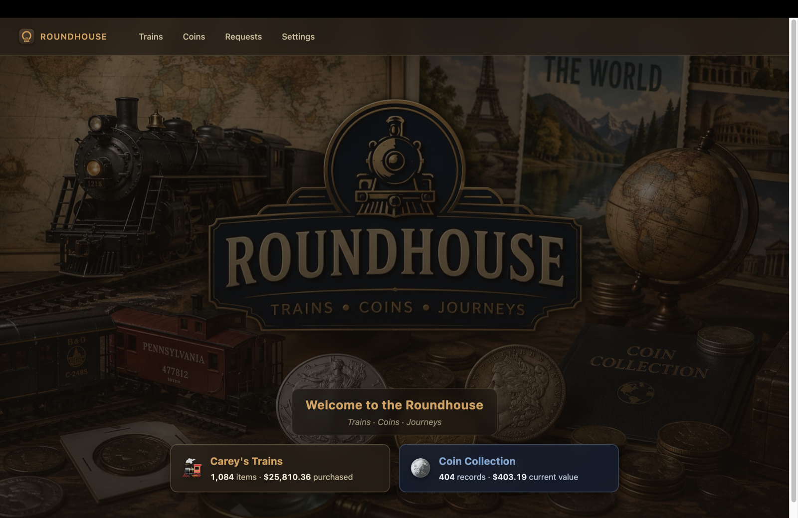
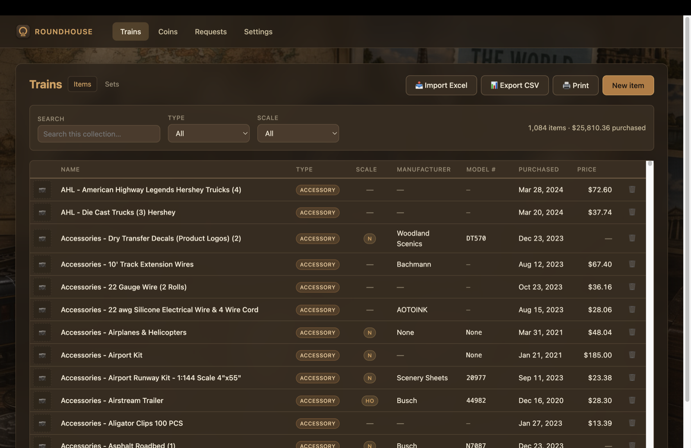
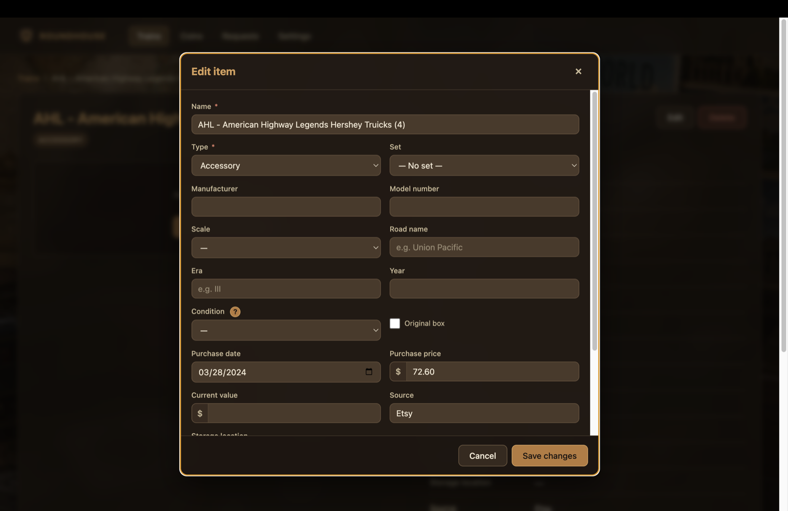
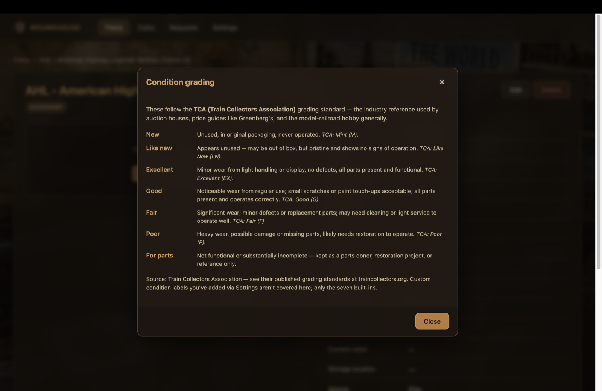

# Roundhouse

> **A desktop catalog for model train *and* coin collections — for the analog hobbyist.**

Roundhouse keeps your collection inventory in one tidy, searchable place: every locomotive, rolling-stock car, accessory, and structure on the train side; every coin and bill on the coin side. Photos and short videos per item, books/sets to group things, custom condition grading per item kind (TCA for trains, Sheldon for coins), CSV export, Excel import, one-click backup, and live "comparable listings on eBay" lookups.

Local-first: everything lives in a single SQLite database under your user-data folder. No cloud account required, no subscription, no telemetry. Open source under MIT.



---

## Highlights

- **Two collections, side by side.** Trains and Coins are first-class — each with its own theme (warm brown for trains, navy for coins), its own field set (Scale/Mfg/Model# vs Country/Year/Denomination/Mint), and its own Settings tab.
- **Books / Sets.** Trains can live in **Sets** (Manufacturer + Scale + Era). Coins can live in **Books** (Whitman folders, Dansco albums, custom groupings). Each book/set page shows live totals — coins / units / current value / purchased.
- **Photos and videos per item.** Drag & drop or pick from disk. JPEG / PNG / WebP / GIF for photos, MP4 / WebM / MOV for video. Lightbox plays both with keyboard nav.
- **Condition grading.** TCA (Train Collectors Association) for trains; Sheldon scale (P-1 → MS-70 + Proof) for coins. Built-in "?" help next to the Condition field shows the right reference.
- **eBay Browse API integration.** On any item's detail page, see comparable active listings — price, image, condition, time-remaining for auctions. Cached per item, refresh on demand. Requires your own eBay developer credentials.
- **Excel import / CSV export.** Bulk-import an inventory spreadsheet (xlsx) without leaving the app. Export the current view to CSV.
- **One-click backup.** Settings → Data → Backup writes a portable .zip containing your DB plus every photo and video. Stash it on a USB drive or a synced cloud folder.
- **Print-friendly listings.** Print the current filtered view; the print stylesheet expands the table and strips chrome.

## A few screenshots

| | |
|:-:|:-:|
| **Trains list** with Items / Sets sub-nav, search + filter, kind-aware columns | **Edit item** dialog with Type, Manufacturer, Scale, Year, Condition, etc. |
|  |  |
| **Condition grading** help — kind-aware (TCA for trains, Sheldon for coins) | (more screenshots welcome — see the home image above) |
|  | |

---

## Install (Windows)

1. Grab the latest `Roundhouse-Setup-X.Y.Z.exe` from the [Releases page](https://github.com/Sur-92/roundhouse/releases).
2. Run it. The installer is per-user (no admin rights needed).
3. Roundhouse auto-updates on launch — when a new release lands you'll get a "Restart now / Later" prompt.

> **Heads up:** the .exe is not code-signed yet, so SmartScreen will warn on first install. Click "More info" → "Run anyway".

Mac / Linux builds aren't currently published — the project builds for those targets but the focus right now is Windows. If you want to run on Mac / Linux, see *Development* below.

## Where your data lives

| | Windows | macOS |
|---|---|---|
| Database | `%APPDATA%\roundhouse\roundhouse.db` | `~/Library/Application Support/roundhouse/roundhouse.db` |
| Photos / videos | `%APPDATA%\roundhouse\photos\<item_id>\…` | `~/Library/Application Support/roundhouse/photos/<item_id>/…` |
| eBay credentials | `%APPDATA%\roundhouse\ebay.json` *(optional)* | `~/Library/Application Support/roundhouse/ebay.json` *(optional)* |

The repo never contains your data. The installer never touches your data — uninstalling Roundhouse leaves it intact, and you can use **Settings → Data → Backup** at any time to make a portable .zip.

## Hierarchy

```
Collection (kind: trains | coins)
├─ Set / Book           (optional grouping)
└─ Item                 (one per locomotive / coin / accessory)
    └─ Media            (photos and videos)
```

Train item types: `locomotive`, `rolling_stock`, `building`, `figurine`, `track`, `scenery`, `accessory`, `other` (extensible from Settings).

Coin item types: `coin`, `bill` (extensible from Settings).

## eBay integration

Roundhouse uses the **eBay Browse API** (Client Credentials OAuth flow) to show comparable active listings for any item. To enable it:

1. Sign up for a free [eBay Developer account](https://developer.ebay.com/) and create a *Production* application.
2. Drop a file named `ebay.json` into your user-data folder (paths above) with:

```json
{
  "app_id": "YOUR_PRODUCTION_APP_ID",
  "cert_id": "YOUR_PRODUCTION_CERT_ID",
  "marketplace": "EBAY_US"
}
```

3. Restart Roundhouse. Open any item's detail page and the "Active eBay listings" panel will populate.

Credentials are read by the main process only and never crossed to the renderer. Search results are cached per item for one hour to keep API quota use low.

---

## Stack

- **Electron 33** + **TypeScript 5** (main, preload, renderer all strict)
- **Vite** (via [`electron-vite`](https://electron-vite.org/)) for build and dev hot-reload
- **better-sqlite3** for the local database (synchronous, embedded, WAL-mode)
- **electron-builder** for packaging (Windows NSIS, macOS DMG, Linux AppImage)
- **exceljs** for xlsx import, **archiver** for zip backups
- Plain TypeScript renderer — no React / Vue / Svelte. Bare DOM + a tiny set of helpers.

## Security posture

- `contextIsolation: true`, `sandbox: true`, `nodeIntegration: false`
- Renderer talks to main only through a typed IPC bridge in the preload
- Strict CSP — `default-src 'self'`; no remote resources from the renderer
- Photos / videos served via a custom `app://` protocol scoped to the user-data dir (no arbitrary file access)
- SQLite WAL mode, checkpointed on app close

## Development

Requires Node 20+. First-time setup uses a custom script because plain `npm install` runs `better-sqlite3`'s gyp build against the system Node, which we don't want — we rebuild it against Electron's ABI instead.

```bash
npm run setup        # first-time only: install + Electron binary + native rebuild
npm run dev          # launches Electron with hot reload
npm run typecheck    # strict TS check across main + renderer
npm run build        # bundles to ./out
npm run build:win    # produces a Windows installer in ./release
npm run start        # build + launch (production-style)
```

If you ever blow away `node_modules`, run `npm run setup` again (not `npm install`).

## License

MIT — see [LICENSE](LICENSE). © 2026 Steve Beamesderfer.
